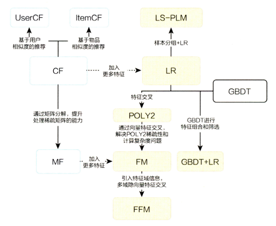
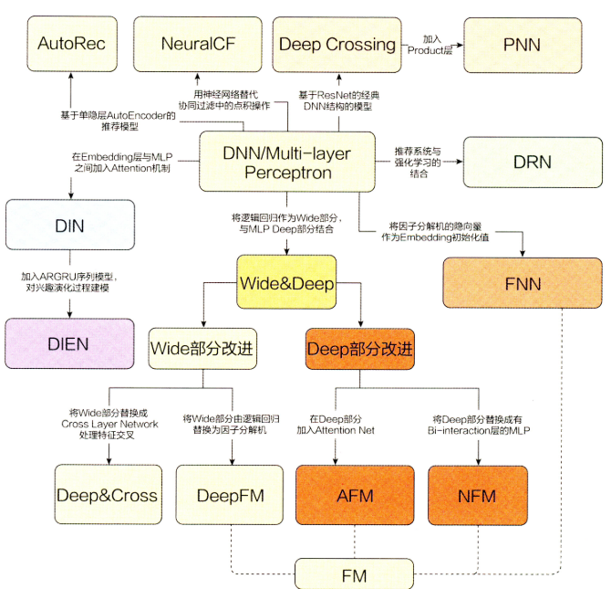

# AI-RecommenderSystem
该仓库尝试整理推荐系统领域的一些经典算法模型，主要包括传统的推荐算法模型和深度学习模型， 并尝试用浅显易懂的语言把每个模型或者算法解释清楚！此次整理依然是通过CSDN博客+GitHub的形式进行输出， CSDN主要整理算法的原理或者是经典paper的解读， 而GitHub上主要是模型的复现和实践。

# 1. 传统的推荐算法模型

## [1.1 协同过滤算法](https://github.com/zhongqiangwu960812/AI-RecommenderSystem/tree/master/CollaborativeFiltering)
协同过滤算法， 虽然这个离我们比较久远， 但它是对业界影响力最大， 应用最广泛的一种经典模型， 从1992年一直延续至今， 尽管现在协同过滤差不多都已经融入到了深度学习，但模型的基本原理依然还是基于经典协同过滤的思路， 或者是在协同过滤的基础上进行演化， 所以这个算法模型依然有种“宝刀未老”的感觉， 掌握和学习非常有必要。  所谓协同过滤(Collaborative Filtering)算法， 基本思想是**根据用户之前的喜好以及其他兴趣相近的用户的选择来给用户推荐物品**(基于对用户历史行为数据的挖掘发现用户的喜好偏向， 并预测用户可能喜好的产品进行推荐)， **一般是仅仅基于用户的行为数据（评价、购买、下载等）, 而不依赖于项的任何附加信息（物品自身特征）或者用户的任何附加信息（年龄， 性别等）**。目前应用比较广泛的协同过滤算法是基于邻域的方法， 而这种方法主要有下面两种算法：
* **基于用户的协同过滤算法(UserCF)**: 给用户推荐和他兴趣相似的其他用户喜欢的产品
* **基于物品的协同过滤算法(ItemCF)**: 给用户推荐和他之前喜欢的物品相似的物品

所以这一块知识的主要内容是UserCF和ItemCF的工作原理和代码实践， 工作原理部分详情见我写的博客, 代码实践是把项亮推荐系统实践里面的协同过滤算法(UserCF和ItemCF)实现了一遍， 并进行详细的解释和说明 
* 优点： 可解释性强， 直观， 简单
* 缺点： 泛化能力差， 没有用到用户， 物品和上下文特征

筋斗云：[AI上推荐之协同过滤](https://blog.csdn.net/wuzhongqiang/article/details/107891787)

## [1.2 隐语义模型与矩阵分解](https://github.com/zhongqiangwu960812/AI-RecommenderSystem/tree/master/LFM_MF)
 协同过滤的特点就是完全没有利用到物品本身或者是用户自身的属性， 仅仅利用了用户与物品的交互信息就可以实现推荐，是一个可解释性很强， 非常直观的模型， 但是也存在一些问题， 第一个就是处理稀疏矩阵的能力比较弱， 所以为了**使得协同过滤更好处理稀疏矩阵问题， 增强泛化能力**， 从协同过滤中衍生出矩阵分解模型(Matrix Factorization,MF), 并发展出了矩阵分解的分支模型。在协同过滤共现矩阵的基础上， 使用更稠密的隐向量表示用户和物品， 挖掘用户和物品的隐含兴趣和隐含特征， 在一定程度上弥补协同过滤模型处理稀疏矩阵能力不足的问题。
 
 这一块的知识主要是隐语义模型的含义， 矩阵分解算法的原理和矩阵分解算法的计算方法， 具体内容我已经写到了博客上面。 
* 优点： 泛化能力强， 空间复杂度低， 更好的扩展性和灵活性
* 缺点：依然没有用到用户， 物品和上下文特征
 
 筋斗云：[AI上推荐之隐语义模型(LFM)和矩阵分解(MF)](https://blog.csdn.net/wuzhongqiang/article/details/108173885)
 
 ## [1.3 GBDT+LR模型](https://github.com/zhongqiangwu960812/AI-RecommenderSystem/tree/master/GBDT%2BLR)
 这是2014年Facebook提出的一个模型，协同过滤和矩阵分解同属于协同过滤家族， 之前分析过这协同过滤模型存在的劣势就是仅利用了用户与物品相互行为信息进行推荐， 忽视了用户自身特征， 物品自身特征以及上下文信息等，导致生成的结果往往会比较片面。 而今天的这两个模型是逻辑回归家族系列， 逻辑回归能够综合利用用户、物品和上下文等多种不同的特征， 生成较为全面的推荐结果。GBDT+LR模型利用GBDT的”自动化“特征组合， 使得模型具备了更高阶特征组合的能力，被称作特征工程模型化的开端。
  **模型原理**： GBDT是一种常用的非线性模型，基于集成学习中boosting的思想，由于GBDT本身可以发现多种有区分性的特征以及特征组合，决策树的路径可以直接作为LR输入特征使用，省去了人工寻找特征、特征组合的步骤。所以可以将GBDT的叶子结点输出，作为LR的输入，如图所示：
 
 
 这一块的重要知识点是LR模型的原理， GBDT模型的原理和细节， 具体内容我已经整理到了博客
 * 优点： GBDT与LR模型互补， 实现了特征工程的自动化模式， 且增加了特征交叉组合的能力， 能够利用更加高阶的特征
 * 缺点： 容易过拟合， 对于调参带来了难度
 
 筋斗云：[AI上推荐 之 逻辑回归模型与GBDT+LR(特征工程模型化的开端)](https://blog.csdn.net/wuzhongqiang/article/details/108349729) 
 
# 2. 深度学习的浪潮之巅

# 参考：
* 项亮-《推荐系统实践》
* 王喆-《深度学习推荐系统》
* [https://github.com/BlackSpaceGZY/Recommender-System-with-TF2.0](https://github.com/BlackSpaceGZY/Recommender-System-with-TF2.0)
* [https://github.com/shenweichen/DeepCTR](https://github.com/shenweichen/DeepCTR)
* 相关论文： [https://github.com/zhongqiangwu960812/ReadPapaers/tree/master/RecommendSystem](https://github.com/zhongqiangwu960812/ReadPapaers/tree/master/RecommendSystem)
